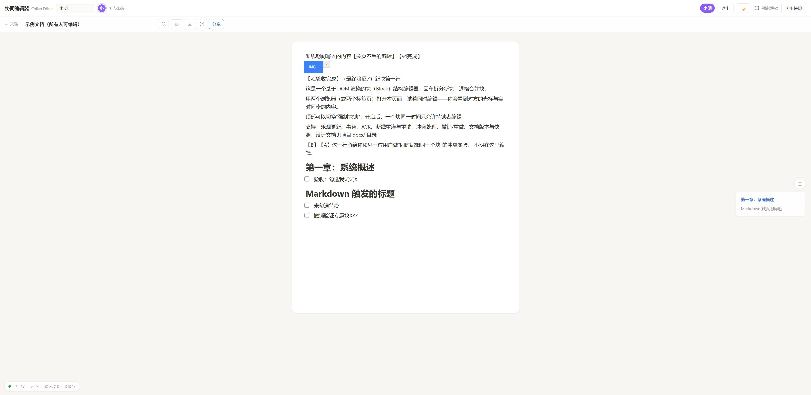
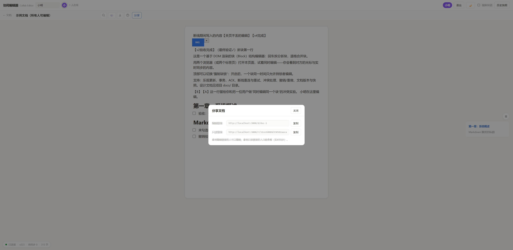

<div align="center">

# Collab Blocks

**基于 DOM 渲染的块结构协同编辑器**

多人实时协作 · 多文档与分享链接 · 自研同步协议（无 OT/CRDT）

[](https://github.com/XYuumi/collab-blocks/actions/workflows/ci.yml)
[](LICENSE)


</div>

---

## ✨ 功能一览

| 类别 | 能力 |
|:---|:---|
| **协同核心** | 实时同步（WebSocket）、远程光标、**跨块远程选区高亮**、块锁（咨询/强制）、乐观更新、事务（Tx）原子提交、ACK、幂等重发、断线重连对账补发、冲突自动合并（块级 CAS + 微型变换）、Undo/Redo |
| **文档与权限** | 多文档管理、**编辑链接 / 只读链接**双轨分享、「仅创建者可编辑」开关、**协作者名单**（按用户名邀请）、用户注册/登录（用户名全局唯一）、回收站（7 天恢复） |
| **编辑体验** | 块类型（标题/列表/待办/代码/图片）、`/` 菜单、Markdown 快捷输入（`# ` `- ` `[ ] ` ```` ``` ````）、图片粘贴（自动压缩）、全文搜索（Ctrl+F 高亮跳转）、大纲导航、快照恢复与对比、四格式导出（Markdown/.md/纯文本/HTML） |
| **协作感知** | 块级评论线程（实时推送 + 未读角标 + 持久化已读）、在线用户列表、连接/版本/待同步状态栏 |
| **工程质量** | 50 个单元测试 + 10 项 E2E 断言、GitHub Actions CI、每次提交即落盘（SQLite）、明暗主题、手机响应式 |






---

## 🚀 快速开始

```bash
git clone https://github.com/XYuumi/collab-blocks.git
cd collab-blocks
npm install        # Node ≥ 22（推荐 24；npm workspaces）

npm test           # 50 个测试：引擎 / WS 协议 / 认证存储 / 多文档权限 / 评论回收站 / 协作者图片 / 性能护栏 + 客户端模型收敛
npm run build      # 构建前端
npm start          # 启动 → http://localhost:3000
```

可选命令：

```bash
npm run dev        # 开发模式：Vite 热更新（5173），/ws 与 /api 代理到 3000
npm run test:e2e   # E2E：本机 Chrome 双开跑 10 项协同断言（需先 build）
```

**体验协同（30 秒）**：注册登录 → 首页「＋ 新建文档」→ 点「分享」复制链接 → 另一个标签页/浏览器打开 → 双方同时编辑，实时看到对方的光标、选区与内容。

<details>
<summary><b>页面路由</b></summary>

| 路径 | 页面 |
|:---|:---|
| `/` | 文档首页：产品介绍卡、我的文档列表、新建/改名/删除、回收站 |
| `/d/:docId` | 编辑页（编辑链接，UUID 即凭据；是否可编辑取决于权限设置） |
| `/r/:roToken` | 只读入口：实时查看他人编辑，整页禁编辑 |

</details>

---

## 🧱 技术栈

| 层 | 选择 | 一句话理由 |
|:---|:---|:---|
| 前端 | TypeScript + Vite + **原生 DOM（无框架）** | contenteditable 的光标/IME 状态必须精确到节点地控制，框架重渲染是这类编辑器的经典坑（[选型详析](docs/07-技术选型对比.md)） |
| 编辑模型 | 每 Block 一个 `contenteditable="plaintext-only"` | 把偏移混乱隔离在块内；`input` 后前后缀 diff 推导操作 |
| 后端 | Node.js + `ws` + Express 单端口 | HTTP 与 WebSocket 同进程，部署即一个命令 |
| 数据库 | Node 内置 `node:sqlite`（零原生依赖） | users / sessions / docs / snapshots / comments / collaborators 六表；**每次提交事务落盘** |
| 认证 | scrypt 加盐哈希 + 会话 token | 密码不落明文；token 可撤销 |
| 测试 | node:test ×50 + puppeteer-core E2E ×10 | 引擎到浏览器的全链路保障 |

---

## 🗂 数据结构

```
Document = { version, structureVersion, blocks: Block[] }          // 服务器为唯一权威
Block    = { id: UUID, type, text, checked?, src? }                // type: text|h1|h2|h3|bullet|todo|code|image
         + 服务器簿记 { blockVersion, lastWriter }                  // 块级 CAS 依据

Op  = block.insert(id, afterId, text, blockType?, src?)
    | block.delete(id) | block.update(id, blockType?, checked?)
    | doc.replace(blocks)                                           // 快照恢复
    | text.insert(blockId, offset, text) | text.delete(blockId, offset, length)

Tx  = { txId, baseVersion, ops[] }                                  // 原子提交 / 幂等重试 / 撤销单位
```

设计要点：操作用 **BlockId/afterId 锚定而非下标**（免疫并发结构漂移）；`version` 全局单调 + 每块 `blockVersion` 细化 CAS，使**不同块并发永不冲突**。→ 详见 [docs/02](docs/02-架构与数据结构.md)

---

## 🔁 协同怎么实现（30 秒版）

1. **乐观更新**：键入本地立即可见，打包为事务（30ms 合批）经 WebSocket 提交，服务器逐个 ACK 并按文档房间广播；
2. **服务器仲裁**：txId 幂等去重 → 角色检查（viewer 拒写）→ 块锁检查 → **块级 CAS** → 副本原子应用 → version+1 → SQLite 落盘；
3. **同块冲突**：后到者被拒（附权威文本）→ 客户端把 pending 操作做"块内微型变换" → 以新基线自动重试 → 双方输入都保留；
4. **可靠性**：超时同 txId 重发；断线指数退避重连 + `sync` 对账（防重复应用）；未确认编辑实时落 localStorage，**关页重开自动恢复**；
5. **快照恢复**：恢复 = 提交一个 `doc.replace` 事务（原子、可撤销、他人端实时同步）。

时序图与消息表见 [docs/03](docs/03-同步协议与可靠性.md)，收敛性论证见 [docs/04](docs/04-冲突处理与一致性.md)。

---

## 🐛 开发中遇到的问题（摘要，全记录在 [docs/06](docs/06-代码审查报告.md)）

1. 结构调和不同步已有块文本 → 重连后 DOM 陈旧且会污染后续 diff（已修复 + 回归覆盖）；
2. 身份伪造（hello 任意 userId 绕过块锁）与跨站 WS 劫持 → token 身份 + Origin 校验；
3. 跨块选区被 offset 比较吞掉（两个偏移分属不同块不可比较）→ 按 focusBlockId 判定；
4. CSS HighlightRegistry 不是 Map 实例导致搜索高亮静默降级 → 鸭子类型检测；
5. Windows Chrome headless 下 `--no-sandbox` 多标签崩溃（E2E 环境坑）。

---

## 📋 还没完成的

- 撤销不感知他人同块修改（选择性撤销属研究级，[路线](docs/04-冲突处理与一致性.md)）；
- 块内富文本样式（跨字符加粗，需 Peritext 级 CRDT）；
- HTTP 未加 TLS（公网部署前置 HTTPS 即可；本项目 token 走请求体非 Cookie，CSRF 不适用）；
- 水平扩展（多进程需 Redis 广播/文档分片）。

## 🗺 继续开发的优化方向

1. 版本化 op log 增量对账（替代全量快照，大文档带宽友好）；
2. 块内变换升级为完整双边变换（OT-lite）或块内文本层引入 CRDT（Yjs）；
3. 外部图片存储（对象存储 + URL 引用，`Block.src` 字段已就位）；
4. 协作者权限细化为完整 ACL、评论通知（邮件/站内信）；
5. 大文档虚拟滚动、多进程 + Redis 分片。

---

## 📖 设计文档

| 文档 | 内容 |
|:---|:---|
| [01 · 功能说明](docs/01-功能说明.md) | 全部功能清单、输入方式速查表、演示脚本、已知限制 |
| [02 · 架构与数据结构](docs/02-架构与数据结构.md) | 总体架构图、技术选型论证、Document-Block 模型、模块清单、关键不变量 |
| [03 · 同步协议与可靠性](docs/03-同步协议与可靠性.md) | 消息表、时序图、仲裁规则、幂等/重连/对账机制 |
| [04 · 冲突处理与一致性](docs/04-冲突处理与一致性.md) | 候选方案对比（FWW/LWW/Reject/Retry）、场景矩阵、收敛性论证、OT/CRDT 演进路线 |
| [05 · 设计自问自答](docs/05-设计自问自答.md) | 35 个设计决策的完整思考过程（题目全部思考题逐条作答） |
| [06 · 代码审查报告](docs/06-代码审查报告.md) | 十轮迭代的 bug/漏洞清单与修复记录、验证矩阵、残留风险 |
| [07 · 技术选型对比](docs/07-技术选型对比.md) | 原生 DOM vs 框架外壳 vs TipTap+Yjs 全家桶的逐项对比与结论 |

## 📄 许可

[MIT](LICENSE) © 2026 XYumi
