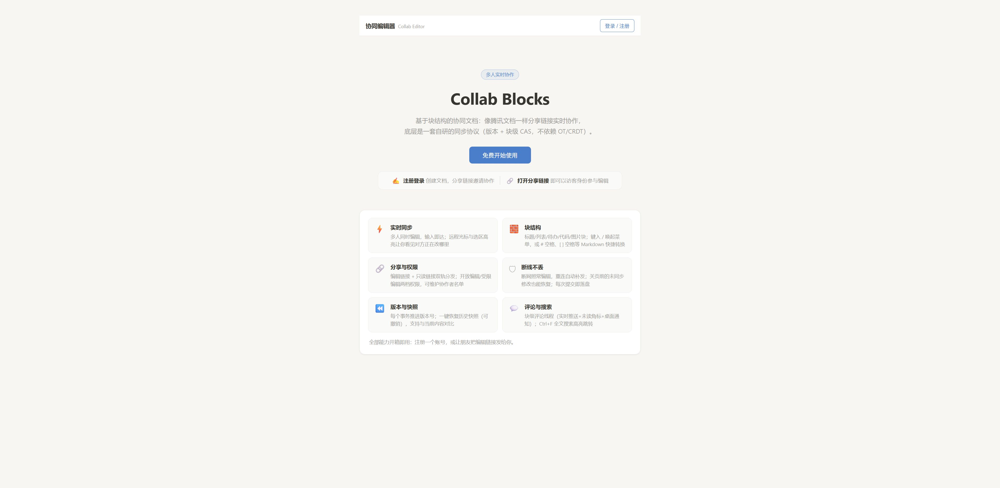

<div align="center">

# Collab Blocks

**基于 DOM 渲染的块结构协同编辑器**

多人实时协作 · 多文档与分享链接 · 三档权限 · 自研同步协议（无 OT/CRDT）

[](https://github.com/XYuumi/collab-blocks/actions/workflows/ci.yml)
[](LICENSE)


</div>

---

## 截图

| 未登录首页 | 登录后首页 |
|:---:|:---:|
|  |  |

| 编辑器（块类型 · 待办 · 大纲 · 评论气泡） | 分享面板（三档权限 · 协作者 · 审批） |
|:---:|:---:|
|  |  |

---

## 功能一览

| 类别 | 能力 |
|:---|:---|
| 协同核心 | 实时同步（WebSocket）、远程光标与跨块选区高亮、块锁、乐观更新、事务原子提交、ACK、幂等重发、断线重连对账补发、冲突自动合并（块级 CAS + 微型变换）、Undo/Redo |
| 文档与权限 | 多文档管理、编辑/只读链接双轨分享、三档权限（开放/登录可编辑/受限）、协作者名单、权限申请审批、用户注册登录、回收站（7 天恢复） |
| 编辑体验 | 块类型（标题/列表/待办/代码/图片）、`/` 菜单、Markdown 快捷输入、块拖拽排序、多选块批量操作、图片粘贴（自动压缩）、全文搜索、大纲导航、快照恢复与对比、四格式导出 + .md/.txt 导入、文档模板 |
| 协作感知 | 块级评论线程、@提及、桌面通知、未读角标、在线用户列表、连接/版本/待同步状态栏 |
| 工程质量 | 52 个单元测试 + 10 项 E2E 断言、GitHub Actions CI、每次提交即落盘（SQLite）、明暗主题、手机响应式、大文档虚拟滚动 |

---

## 快速开始

```bash
git clone https://github.com/XYuumi/collab-blocks.git
cd collab-blocks
npm install
npm run build
npm start          # → http://localhost:28365
```

**体验协同**：注册登录 → 新建文档 → 点「分享」复制链接 → 另一标签页打开 → 双方同时编辑。

<details>
<summary>可选命令</summary>

```bash
npm run dev        # 开发模式：Vite 热更新（5173），代理 /ws /api 到 3000
npm test           # 52 个单元测试
npm run test:e2e   # E2E：本机 Chrome 双开 10 项断言
```

</details>

<details>
<summary>页面路由</summary>

| 路径 | 说明 |
|:---|:---|
| `/` | 文档首页：产品介绍、我的文档列表、新建（模板选择）、回收站 |
| `/d/:docId` | 编辑页（编辑链接，UUID 即凭据） |
| `/r/:roToken` | 只读入口：实时查看，整页禁编辑 |

</details>

---

## 技术栈

| 层 | 选择 | 理由 |
|:---|:---|:---|
| 前端 | TypeScript + Vite + 原生 DOM | contenteditable 光标/IME 必须精确到节点控制 |
| 编辑模型 | 每 Block 一个 `plaintext-only` CE | 偏移混乱隔离在块内；diff 推导操作 |
| 后端 | Node.js + ws + Express 单端口 | HTTP 与 WS 同进程，一条命令部署 |
| 数据库 | Node 内置 node:sqlite | 零原生依赖；六表；每次提交事务落盘 |
| 认证 | scrypt + 会话 token | 密码不落明文；token 可撤销 |
| 测试 | node:test + puppeteer-core E2E | 引擎到浏览器全链路 |

---

## 数据结构

```
Document = { version, structureVersion, blocks: Block[] }
Block    = { id: UUID, type, text, checked?, src? }
           + { blockVersion, lastWriter }              // 块级 CAS 依据

Op  = block.insert | block.delete | block.update
    | block.move | doc.replace                        // 快照恢复
    | text.insert | text.delete

Tx  = { txId, baseVersion, ops[] }                    // 原子提交/幂等/撤销单位
```

操作用 BlockId 锚定而非下标；version 全局单调 + blockVersion 细化 CAS，不同块并发永不冲突。详见 [docs/02](docs/02-架构与数据结构.md)。

---

## 协同原理（30 秒）

1. **乐观更新**：键入本地立即可见 → 事务合批（30ms）→ WebSocket 提交 → 服务器 ACK + 广播
2. **仲裁**：txId 幂等 → 角色检查 → 块级 CAS → 原子应用 → SQLite 落盘
3. **冲突**：后到者被拒 → 块内微型变换 → 自动重试 → 双方输入保留
4. **可靠性**：超时重发、断线对账、关页恢复（localStorage）
5. **快照**：恢复 = `doc.replace` 事务（原子、可撤销）

详见 [docs/03](docs/03-同步协议与可靠性.md) / [docs/04](docs/04-冲突处理与一致性.md)。

---

## 设计文档

| # | 文档 | 内容 |
|:-:|:---|:---|
| 01 | [功能说明](docs/01-功能说明.md) | 功能清单、输入方式、已知限制 |
| 02 | [架构与数据结构](docs/02-架构与数据结构.md) | 架构图、选型论证、模块清单 |
| 03 | [同步协议与可靠性](docs/03-同步协议与可靠性.md) | 消息表、时序图、幂等/重连/对账 |
| 04 | [冲突处理与一致性](docs/04-冲突处理与一致性.md) | 方案对比、场景矩阵、收敛性论证 |
| 05 | [设计自问自答](docs/05-设计自问自答.md) | 35 个设计决策的完整思考 |
| 06 | [审查报告](docs/06-审查报告.md) | 十六轮迭代的 bug 清单与修复 |
| 07 | [技术选型对比](docs/07-技术选型对比.md) | 原生 vs 框架 vs TipTap+Yjs |

---

## 未完成与优化方向

<details>
<summary><b>还没完成的</b></summary>

- 撤销不感知他人同块修改（选择性撤销属研究级）
- 块内富文本样式（跨字符加粗，需 Peritext 级 CRDT）
- HTTP 未加 TLS（公网部署前置 HTTPS）
- 水平扩展（多进程需 Redis 广播/文档分片）

</details>

<details>
<summary><b>继续优化方向</b></summary>

1. 版本化 op log 增量对账
2. 块内变换升级为 OT-lite 或引入 CRDT
3. 外部图片存储（对象存储 + URL）
4. 完整 ACL、评论通知
5. 多进程 + Redis 分片

</details>

---

## 许可

[MIT](LICENSE) © 2026 XYumi
