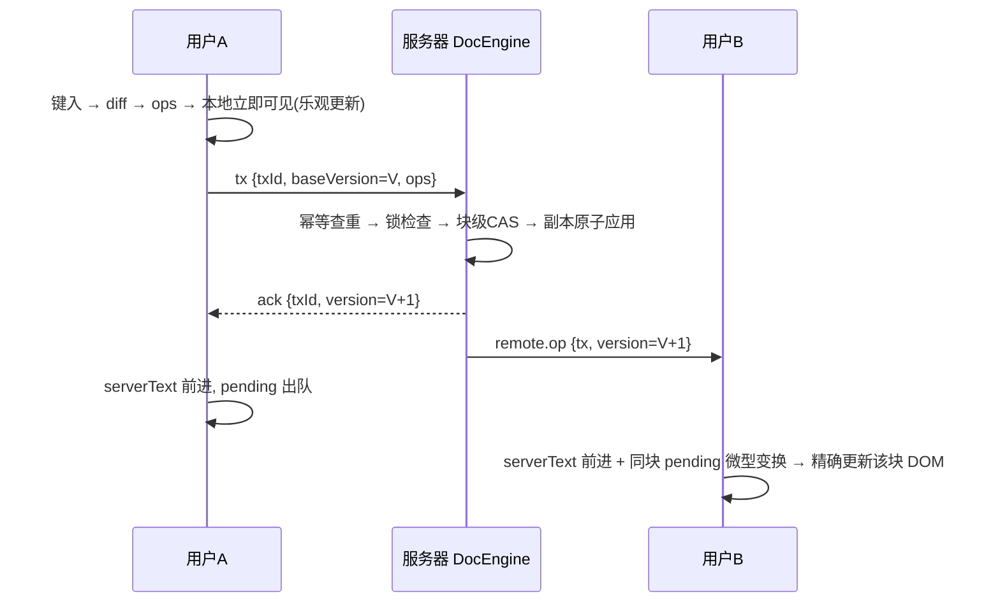
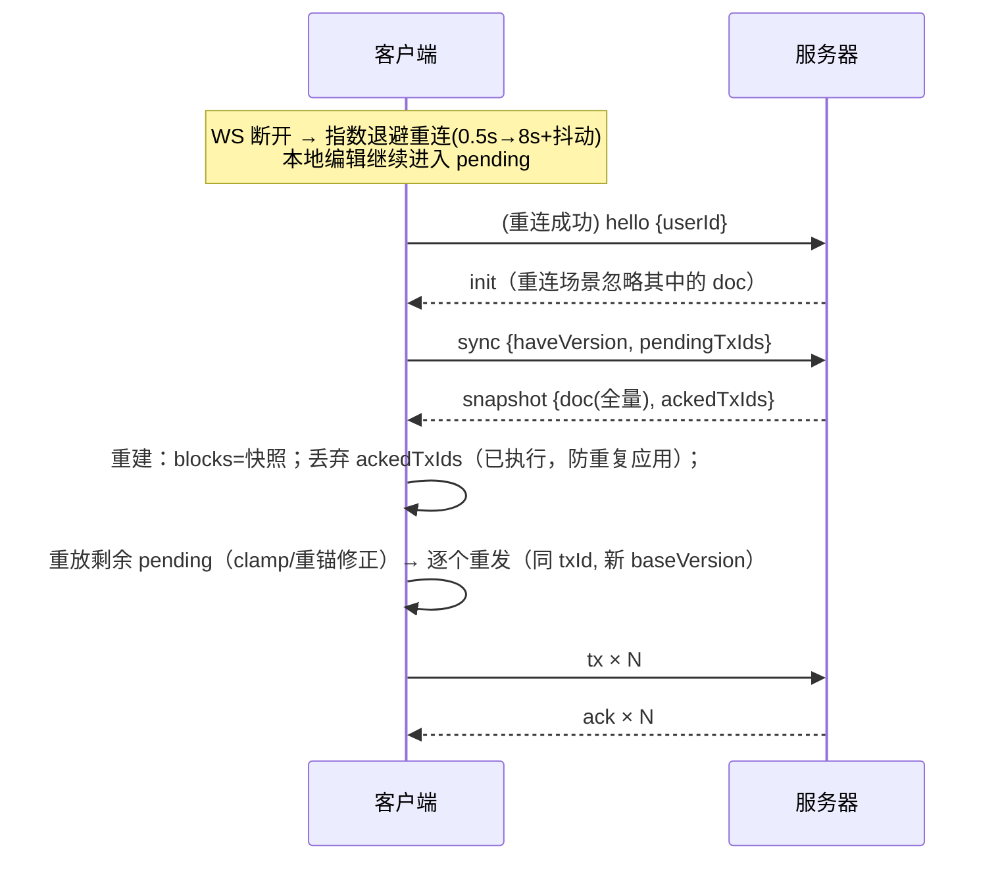

# 03 · 同步协议与可靠性

## 1. 消息一览（定义见 `shared/protocol.ts`）

### 客户端 → 服务器
| 消息 | 时机 | 说明 |
|---|---|---|
| `hello {docId, token?, mode?, name?}` | 连接建立后 | **连接绑定单一文档（房间）**。持有效 token 继承登录/访客身份，否则服务端创建访客；`mode:"view"`（只读链接进入）强制 viewer。userId 一律服务端分配，客户端不可指定（防冒名/绕锁） |
| `tx {tx}` | 编辑（合批 30ms / 手势立即） | 事务提交，等待 ack/nack。规模上限：ops≤200、单条文本≤100K、doc.replace≤2000 块/400K 字符；viewer 发送直接拒绝 |
| `cursor {blockId, offset, focusOffset?}` | 选区变化（节流 120ms） | 无确认，尽力转发；仅同文档房间；viewer 不上报；**focusOffset 存在且 > offset 表示选区**（他人端渲染半透明选区高亮） |
| `lock.acquire {blockId}` | 聚焦块 / 每 5s 续期 | 申请或续期块锁（TTL 15s）；锁按 `${docId}:${blockId}` 作用域隔离 |
| `lock.release {blockId}` | 失焦 | 释放（连接断开由服务器强制释放） |
| `sync {haveVersion, pendingTxIds}` | 重连后 | 对账：我落后多少、我还有哪些未确认 |
| `ping` | 每 5s | 心跳，超时 15s 剔除 |
| `config {lockEnforced}` | 顶栏开关 | 切换强制块锁（广播；viewer 无权） |

改名走 HTTP `POST /api/auth/rename`（全局唯一校验，成功后服务器广播刷新 presence）。

### 服务器 → 客户端
| 消息 | 说明 |
|---|---|
| `init {you, token, doc, presence, locks, config, role}` | 全量初始化；token 为本次会话令牌（客户端存 sessionStorage）；**role = owner/editor/viewer**（由进入方式 + 文档归属 + enforceOwnerEdit 决定） |
| `ack {txId, version}` | 事务已提交，附结果版本 |
| `nack {txId, reason, version, blocks?}` | 事务被拒；CONFLICT 附冲突块权威文本 |
| `remote.op {tx, version}` | **同文档房间内**广播他人已提交事务（不含发送者） |
| `presence {users}` | 同文档在线列表变化 |
| `cursor {userId, blockId, offset}` | 同文档他人光标 |
| `lock.changed {blockId, lock\|null}` / `lock.denied` | 锁获得/释放/过期 / 申请被拒 |
| `config.changed {config}` | 同文档强制锁开关变化 |
| `snapshot {doc, reason:"sync", ackedTxIds}` | 重连对账回包：全量快照 + "你的 pending 中哪些其实已执行" |
| `comment.added {docId, comment}` | 块级评论新增（POST /comments 后向该文档房间广播，含发送者；客户端按 id 去重） |
| `error {message}` | 文档不存在 / 只读模式写操作 / 服务器内部错误等 |

### HTTP（REST）
| 路由 | 说明 |
|---|---|
| `POST /api/auth/register · login · logout · rename` | 用户系统（scrypt + 会话 token，用户名全局唯一） |
| `GET /api/docs` | 我的文档 + 公共示例（登录后；返回服务器侧身份） |
| `POST /api/docs {title}` | 新建文档（仅注册用户；访客 403） |
| `GET /api/docs/:id/meta` | 标题 / enforceOwnerEdit / 是否创建者（公开） |
| `PATCH /api/docs/:id {title?, enforceOwnerEdit?}` | 改名 / "仅创建者可编辑"开关（仅创建者） |
| `DELETE /api/docs/:id` | 删除文档及快照（仅创建者） |
| `GET /api/docs/:id/ro` | 懒生成并返回只读链接令牌 |
| `GET /api/ro/:token` | 只读令牌 → docId（公开映射） |
| `GET /api/docs/:docId/snapshots[/.../:v]` | 快照列表 / 内容 |
| `GET/POST /api/docs/:docId/collaborators`、`DELETE .../collaborators/:userId` | 协作者名单：查看 / 按用户名邀请（仅创建者）/ 移除（仅创建者）——enforce 开启时名单内仍为 editor |
| `GET/POST /api/docs/:docId/comments`、`POST .../comments/:id/resolve` | 块级评论：列表 / 新增（enforce 开启时非 owner 403）/ 切换解决 |
| `GET /api/docs/trash/list`、`POST /api/docs/:id/restore`、`POST /api/docs/:id/purge` | 回收站：列表 / 恢复（7 天内）/ 彻底删除（均限创建者） |
| `GET /api/health` | 健康检查（版本 / 在线数 / 活跃文档数） |

### 连接层安全（服务器强制）
- **Origin 校验**：浏览器连接必须同源（或 Vite 5173 开发端口），否则 1008 关闭——防跨站 WS 劫持；
- **maxPayload 512KB**；认证/文档路由 body ≤16KB；
- **限流**：每连接 2s 窗口 ≤120 条消息，超限断开；
- 作者身份一律取会话身份覆盖客户端字段；**viewer 角色的一切写路径（tx/锁/配置）在服务器侧拒绝**。

## 2. 正常编辑流



要点：
- **乐观更新**：键入到显示零往返延迟；ack 只做簿记（serverText 前进、pending 出队），不改可见文本。
- **remote.op 不发回发送者**：发送者通过 ack 知晓，避免自己收到自己的操作导致双重应用。
- 同一 WebSocket 内消息有序：客户端依赖"ack(V) 先于 remote.op(V+1) 到达"来维持折叠等价。

## 3. 事务仲裁规则（服务器，DocEngine.submit）

```
1. txId 已在"已执行"缓存 → 直接返回缓存的结果版本（幂等，不重复执行）
2. baseVersion > 当前版本 → nack INVALID（客户端触发整包对账）
3. 在文档副本上顺序应用 ops（任一步失败 → 丢弃副本，整体 nack）：
   a. 锁检查：强制锁开启且块被"他人"持有 → nack LOCKED
   b. 块级 CAS：block.blockVersion > tx.baseVersion 且 block.lastWriter ≠ author
      → nack CONFLICT（附该块当前权威文本）
      - 同作者豁免：自己连续提交的事务不会和自己冲突（本就顺序可叠）
   c. block.insert：id 已存在 → 跳过（幂等）；锚点缺失 → 宽松重锚到末尾
   d. block.delete：块已不存在 → 该 op 退化为 no-op（语义已达成）
   e. 文本 op：偏移做防御性 clamp
4. 成功 → version+1，触碰块 blockVersion=新版本/lastWriter=author，
   结构变更 structureVersion+1，进入幂等缓存，回调广播与持久化
```

## 4. ACK / 幂等 / 超时重发

**为什么需要 txId 幂等**：客户端 5s 未收到 ack 时会重发同一事务；若 ack 在网络中丢失
而服务器已执行，重发若无幂等保护就会执行两次（字符重复、版本膨胀）。

**实现**：服务器维护 `txId → resultVersion` 缓存（仅缓存**成功**结果；nack 表示
"未执行"，重发必须重新评估，不能缓存拒绝）。客户端重发永远用**原 txId**：
- 若已执行 → 服务器返回缓存 ack（客户端推进版本，状态一致）；
- 若未执行 → 重新走仲裁。

被 `nack` 拒绝后走修复管线重建的 pending，重发时也**沿用原 txId**——此时原事务必然
未被服务器执行（nack 的语义保证），且重建 ops 与原 ops 在"服务器未执行"的前提下等价
（未受影响块的 ops 不变；受影响块的原 ops 必然会被服务器拒绝）。推导见 docs/05 Q7。

## 5. 断线重连与对账



为什么要 `pendingTxIds`/`ackedTxIds` 对账：断线期间客户端无法知道"已发出但 ack 丢失"
的事务是否被服务器执行。快照**包含**了已执行部分——若客户端把所有 pending 一律重放，
已执行的会被本地重复应用（字符重复）。服务器对照幂等缓存回告已执行集合，客户端将其
从 pending 中剔除，余下的重放才是安全的。该场景有测试覆盖
（`client/test/model.test.ts`："断线重连对账"）。

## 6. 冲突修复管线（NACK CONFLICT / LOCKED 共用）

```
收到 nack：
  CONFLICT → rollbackVisible()：全部 pending 逆序反演回滚到服务器状态
             → 覆盖 nack.blocks 权威文本
             → replayPending()：顺序重放（文本 clamp、结构重锚；
                pending 文本 op 此前已被"微型变换"平移过，重放即合并）
             → resubmitAll()：以当前版本为基线重发全部 pending（原 txId）
  LOCKED   → 同上，但重放时丢弃"对他人持锁块"的写操作（用户编辑被拒，Toast 提示）
  INVALID  → 触发 sync 整包对账（异常兜底）
```

微型变换与收敛性论证见 docs/04。

## 7. 可靠性设计取舍

| 问题 | 方案 | 为什么 |
|---|---|---|
| 消息丢失 | WebSocket + TCP 有序可靠；断线即重连 + 对账，不做单消息重传 | 编辑流允许"整包对账"这种粗粒度恢复，比逐消息重传简单且足够 |
| 重复消息 | 事务级幂等（txId） | 协议层唯一需要的幂等点 |
| 乱序 | 单连接内天然有序；重连后全量快照重置基线 | 避免实现 op log 回放 |
| 服务器崩溃 | 每次提交事务写 SQLite（engine.onCommit 回调）+ 每 50 版本快照 | 重启零丢失（有重启一致性测试）；比 v1 的防抖落盘消除了 200ms 窗口 |
| 锁僵死 | TTL 15s + 持锁者 5s 续期 + 断连强制释放 | 无需运维介入的自愈 |
| presence 幽灵 | 心跳 5s + 15s 超时剔除 | 同上 |
| 恶意连接 | Origin 校验 + maxPayload + 每连接限流 + Tx 规模上限 | 见 docs/06 安全加固 |
